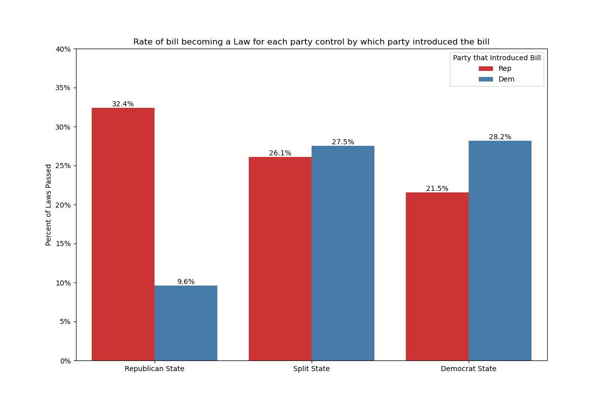

# Predicting Whether a Bill will become Law
---
## Contents:

- [Problem Statement](#Problem-Statement)
- [Software Requirements](#Software-Requirements)
- [Data Sources](#Data-Sources)
- [Data Cleaning](#Data-Cleaning)
- [Data Dictionary](#Data-Dictionary)
- [Exploratory Data Analysis](#Exploratory-Data-Analysis)
- [Data preprocessing](#Data-Preprocessing)
- [Model Building](#Model-Building)
- [Conclusions and Recommendations](#Conclusions-and-Recommendations)
---
## Problem Statement

The goal of this study is to develop machine learning classification models predicting whether a state bill will pass or not using Natural Language Processing of the bill's title. Performance of this model will be guided by balanced accuracy, and should improve on the baseline accuracy by 10%. 

---
## Software Requirements
- Pandas
- Scikit-learn
- Imblearn
- numpy
- matplotlib.pyplot
- seaborn
- plotly

---
## Data Sources
The Data for this project came from severall sources and then was merged together. 

The Legislative composition data for years 2017-2023 comes from the National Conferance of State Legislatures [website](https://www.ncsl.org/about-state-legislatures/state-partisan-composition). The data has information on the party composition of state legislators for each state. It also has the party for each governor. This data needed some preprocessing to convert it into the wanted format of csv files as it is stored in pdf files. 

The Bills data is from the Open States [website](https://openstates.org/data/session-csv/). Open States is an organization that aggregates, standardizes, and cleans legislative data for all 50 states. The data used for this study is from the bulk data they offer of proposed bills in the state's legislature. The data is stored in zip files for each legislative session by state. Open States scrapes their data directly from government websites and seems to be quite reliable. The data on the legislatures party also comes from Open Sates, but from their python [API](https://openstates.github.io/pyopenstates/). A limitation off the API is that there is a limit of requests that can be made per day. Because of this, a few days were needed to collect all of the Legislature data. To use the API you need to create an account and then get an API key from Open States.

The Legislative Bills Progression data comes from the Harvard Dataverse and was published by Dr. Garlick in April, 2023 ([link to data](https://dataverse.harvard.edu/dataset.xhtml?persistentId=doi:10.7910/DVN/8PTHXT)). The dataset contains over a million bills for all states from the years of 2011 to 2019. It includes the 23 step progression of each bill showing where it failed or if it was enacted into law. Dr. Garlick and his team used Open Sates to create this data set.

After merging all of the datasets together, we ended up with two datasets; one with almost 160,000 bills and the other with around 85,000 bills. The smaller dataset is a subset of the larger one but has more information with it. It includes a column of which party sponsored the bill.

---
## Data Cleaning

First, many redundant columns were removed. They were removed because either they had too many missing values, or because they were irrelevant to the study. Secondly, some columns were cleaned up a bit. For example, the subject column had a list of subjects that the bill relates to. It would be more useful if it was in just a normal string format rather than a list so word count vectorizer could be used on it in the modeling phase. Lastly, we will have to get rid of a big chunk of our data because we are only interested in types of Legislation that can infact become laws. The column statute helped with this phase.

Before cleaning, the bigger dataset with one less column had 160,000 bills with 63 columns. After cleaning it has around 110,000 bills with 19 columns. The smaller dataset had around 85,000 bills and ended with 60,000 bills.

---
## Data Dictionary

|Feature|Type|Original Source|Description|
|---|---|---|---|
|**id**|*object*|Open States|Bill ID used on Open States website|
|**classification**|*object*|Open States|Type of legislation. e.g. "bill" or "resolution"|
|**title**|*object*|Open States|Title of bill|
|**subject**|*object*|Open States|Main subjects bill refers to.|
|**abstract**|*object*|Open States|Abstract of bill.|
|**state**|*object*|Open States|State the bill was introduced in.|
|**organization_classification**|*object*|Open States|Which house the bill was introduced in.|
|**year**|*int*|Garlick|Year the bill was introduced.|
|**bill_pre**|*object*|Garlick|Prefix of the bill.|
|**statute**|*int*|Garlick|Whether the bill is a statute or not.|
|**lpcode**|*float*|Garlick|Code that correlates to where the bill failed.|
|**pass_1st_chamber**|*int*|Garlick|Passed the first chamber or not.|
|**pass_2nd_chamber**|*int*|Garlick|Passed the second chamber or not.|
|**law_enacted**|*int*|Garlick|Enacted as law.|
|**senate_dem**|*int*|NCSL|Number of democratic state senators.|
|**senate_rep**|*int*|NCSL|Number of republican state senators.|
|**house_dem**|*int*|NCSL|Number of democrats in the house.|
|**house_rep**|*int*|NCSL|Number of republicans in the house.|
|**gov_party**|*object*|NCSL|Party of the state governor.|
|**senate_party**|*object*|NCSL|Party dominant in the Senate|
|**house_party**|*object*|NCSL|Party dominant in the House|
|**state_party_control**|*object*|NCSL|Republican if House, Senate and Governor are republican. Democrat if it is the opposite. Split if there are a mix of parties.|
|**majority_sponsor_party**|*object*|Open States API|Party that introduced the bill. (only in our smaller dataset)|

Links to original datasets:
   - Open States: [website](https://openstates.org/data/session-csv/), [API](https://openstates.github.io/pyopenstates/)
   - [Garlick](https://dataverse.harvard.edu/dataset.xhtml?persistentId=doi:10.7910/DVN/8PTHXT)
   - [NCLS](https://www.ncsl.org/about-state-legislatures/state-partisan-composition)

---
## Exploratory Data Analysis

Before modeling, we investigated our dataset to see how dfferent features related with heart disease. Below are the most interesting graphs from that process.

Our target variable, the bill passing or not, is very imbalanced. This will make it more difficult for our models to predict which bills will become law. Oversampling techniques may be able to help the models performance. 

31% of bills pass the first chamber, 24% pass the second, and 20% end up becoming law.

The hardest chamber for a law to pass is the chamber it was introduced in. Only 31% of the laws pass the first chamber. After passing the first chamber though, laws have an easier time passing the next two steps. 75% of the laws that makee it to the second chamber pass the second chamber and 84% of the laws that make it passed the second chamber get enacted into law.

Party control of each state. Those in red are states with a Republican Governor, House, and Senate. Those in Blue are states with a Democratic Governor, House and Senate. Everything in between those two colors have a mix of democrats and republicans. Notice that most states were republican in 2017.

Nebraska is missing from this map because Nebraska has a univariate congress and thus was left out.

Same as graph above but for 2018. Hard to spot differences from the 2017 graph but it seems like New York and West Virginia became more republican while New Jersey became mored democrat. Very similar to 2017 though.

This graph shows the percentage of bills passing for Republican, Democrat, and Split states for republican and democratic bills. As we can see, it seems that republican states are more partisan. 32% of republican bills pass while only 9% of democrat bills pass in republican states. Split states are fairly equal in the rates they pass bills for each party. Democrat states are fairly partisan with 28% of their own bills passing while 21% of republican bills pass.

---
## Model Building

We built two models for this project,Logistic and Random Forest. Here are the summaries of both.

### Logistic
Logistic regression is a fundamental classification technique. It uses a logistic function to transform the linear regression output into a probability score, which can be interpreted as the likelihood of belonging to a particular class. For this problem, we have categorical features such as the party of the governor and of the chambers. These columns will be onee hot encoded. We also have text data as well. For this, we will need to use Count Vectorizer and Tfidf Vectorizer in order to plug them into the Logistic model.

CountVectorizer is a feature extraction technique used in natural language processing to convert text documents into numerical representations. It creates a matrix where each row corresponds to a document, and each column represents the frequency of a specific word in that document. TF-IDF Vectorizer stands for Term Frequency-Inverse Document Frequency Vectorizer. It is another feature extraction method used in NLP that assigns weights to each word in a document based on its frequency within the document and its rarity across all documents. The resulting matrix reflects the importance of each word in a document relative to the entire corpus. Both of these techniques are used in order to extract information through our modeling.

As our target variable is very imbalanced, oversampling techniques will be used to help our model recognize the unbalanced class. The most notable method we will use is SMOTE, (Synthetic Minority Over-sampling Technique). SMOTE creates synthetic samples of the minority class by interpolating new instances between existing minority class samples, effectively balancing the dataset and improving the performance of classification models on the minority class.

During our modeling, we are trying to optimize for the metric of recall. this is because a bill rarely passes, and it would be helpful for those who use our model to know wether a bill is more likely to pass.

Below is a summary of our results on the test data with our best results in bold.

|Model|accuracy|recall|precision|
|---|---|---|---|
|cv_logit|0.828602|0.349817|0.646362
|cv_lemma_logit|0.830094|0.342857|0.659387
|cv_stem_logit|0.827595|0.319414|0.658113
|tfidif_logit|0.834757|0.298168|0.731357
|cv_SMOTE_logit|0.752247|0.634982|0.427181
|cv_OverSample_logit|0.746988|0.649084|0.421353
|**tfidf_SMOTE_logit**|**0.747920**|**0.658425**|**0.423539**

The model in bold has lower accuracy than the baseline model. This is okay though because we are trying to optimize for recall. This model can identify 66% of the bills that pass from the test data. When it does think it is a passed bill, it is correct 42% of the time. These may not be the best results, and this could be due to the lack of information in some titles. For example, the bill titled 'An Act establishing the Jonesville Public Use Area.' may not be very useful to our model. This is not enough info to predict whether it will pass or not. in the next notebook, Random Forest are used to predict bill outcome based off of their titles and results are slightly better there. 

We also tested models on different text data such as the bills subjects and abstracts. Although these are outside the scope of the problem statement, they show promise to improve on our model in future studies.

|Model|accuracy|recall|precision|
|---|---|---|---|
|subjects_SMOTE|0.728441|0.643970|0.395400
|abstracts_SMOTE|0.782182|0.714592|0.521739

These are impressive results as the recall is quite high and the accuracy is very close to the baseline. The precision is also quite high. This is very promissing for further research.

No inference was done for this model because the performance is too poor to have any valuable inference from it.

### Random Forest

Random Forest Classifier is a complicated model than the Logistic Regression. It is an ensemble learning algorithm that combines multiple decision trees to make predictions. It operates by constructing a multitude of decision trees during training and outputs the class that is the mode of the classes predicted by individual trees. The features used in this model are similar to the logistic regression. We have categorical features such as the party of the governor and of the chambers. These columns will be one hot encoded. We also have text data as well. For this, we will need to use Count Vectorizer and Tfidf Vectorizer in order to plug them into the Logistic model.

CountVectorizer is a feature extraction technique used in natural language processing to convert text documents into numerical representations. It creates a matrix where each row corresponds to a document, and each column represents the frequency of a specific word in that document. TF-IDF Vectorizer stands for Term Frequency-Inverse Document Frequency Vectorizer. It is another feature extraction method used in NLP that assigns weights to each word in a document based on its frequency within the document and its rarity across all documents. The resulting matrix reflects the importance of each word in a document relative to the entire corpus. Both of these techniques are used in order to extract information through our modeling.

As our target variable is very imbalanced, oversampling techniques will be used to help our model recognize the unbalanced class. As with our last model, we will again use SMOTE, but we will find better results by changing a hyperparameter in the Random Forest Classifier called class weight. Changing this hyper parameter to 'balanced_subsample' will boost the importance of the smaller class making it easier for the model to recognize the bills passing class.

We used many combinations of mdoels and tuned the hyperarameters. Here is a summery of the results:

|Model|accuracy|recall|precision|
|---|---|---|---|
|rf|0.827260|0.427473|0.607971
|rf_hyperparams_overfit|0.836063|0.354762|0.689569
|rf_hyperparams_better|0.837778|0.293407|0.765409
|rf_hyperparams_sample_leaf|0.829460|0.212088|0.810924
|**rf_hyperparams_balanced_subsamples**|**0.725391**|**0.740293**|**0.404767**
|rf_SMOTE|0.759223|0.612637|0.435264
|smaller_df|0.765522|0.669839|0.483469

The best model was one with the balanced subsamples and other hyperparameters tuned. It is able to identify 75% of the passed bills in the test set and when it gets predicts it is going to be enacted, it is correct 40% of the time. This isn't the most impressive result but could be of some use to people interested in having a better idea whether a bill will pass or not. 

Also did random fores tusing the abstracts instead.

|Model|accuracy|recall|precision|
|---|---|---|---|
abstracts|0.74913|0.752146|0.473809

This model using the abstracts does very well compared to the titles. This may be because there is more information in the abstracts. It is outside the scope of our problem statement though but shows promise for further study.

## Conclusions and Recommendations

